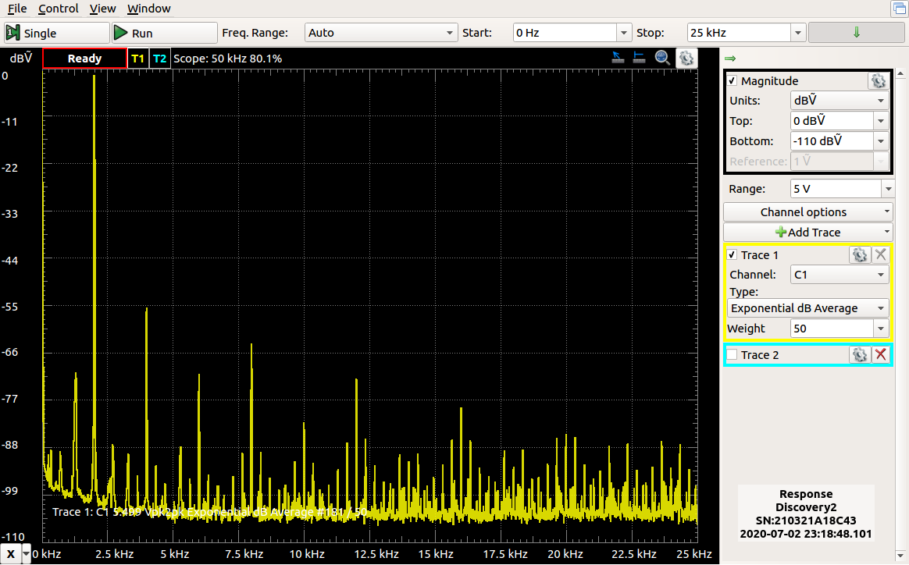
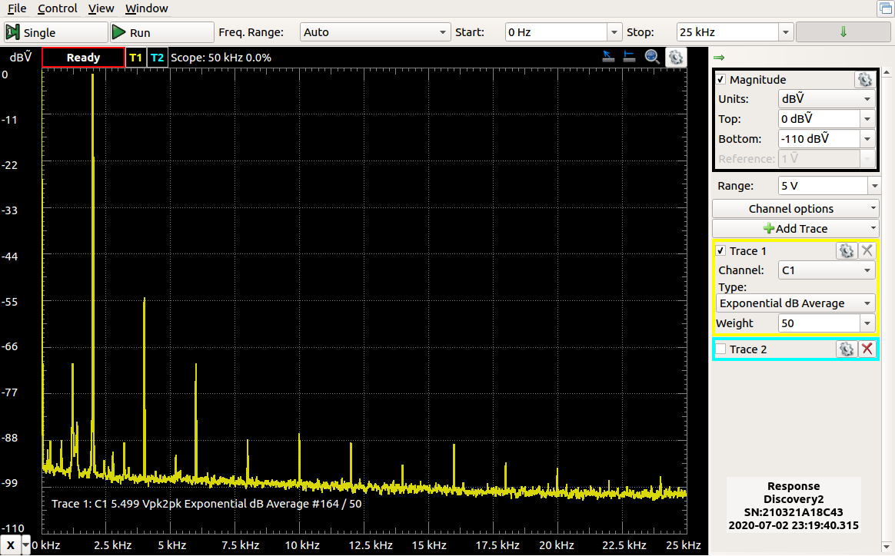

# second_order_sigma_delta
A comparison of 1st and 2nd order sigma delta DAC for implementation in an FPGA.

This small project implements two 16-bit DACs, one being a first order, the second being a second order. The Verilog and VHDL are functionally identical implmentations.

A new sample is provided from a 50-entry lookup table every 1000 clock cycles, so with a 100MHz clock it generates a 2.000kHz signal.

External to the FPGA will need to be a passive low pass filter.

Spectrum of the 1st order DAC:

Spectrum of the 2nd order DAC:

Note: These are old images - the spectrums are subtantially better when the DACs are updating at a slower rate (e.g. 25MHz).

Code for the DAC modules is in VHDL and Verilog

The lower two switches control which DAC is active, the next two control the rate they clock at (full, 1/2, 1/4 or 1/8th of the clock rate).
